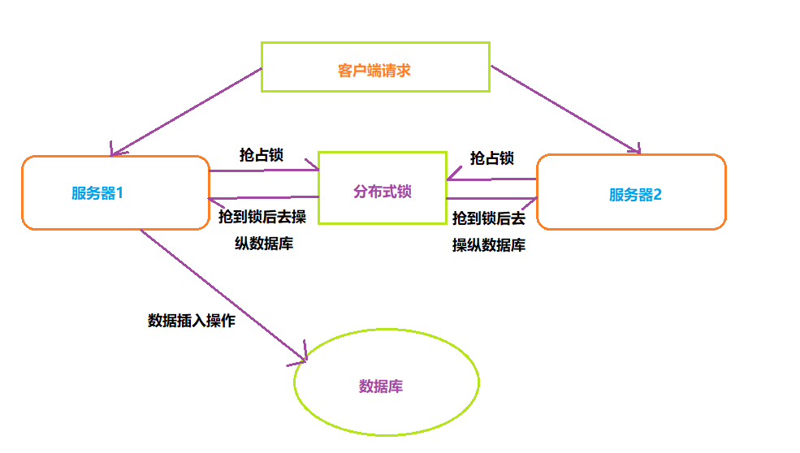
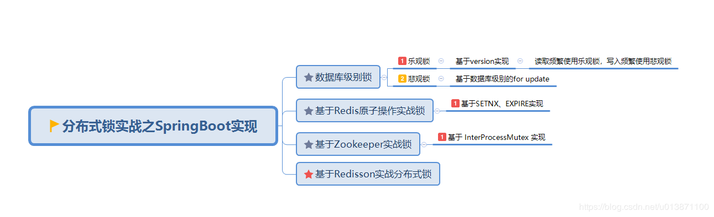
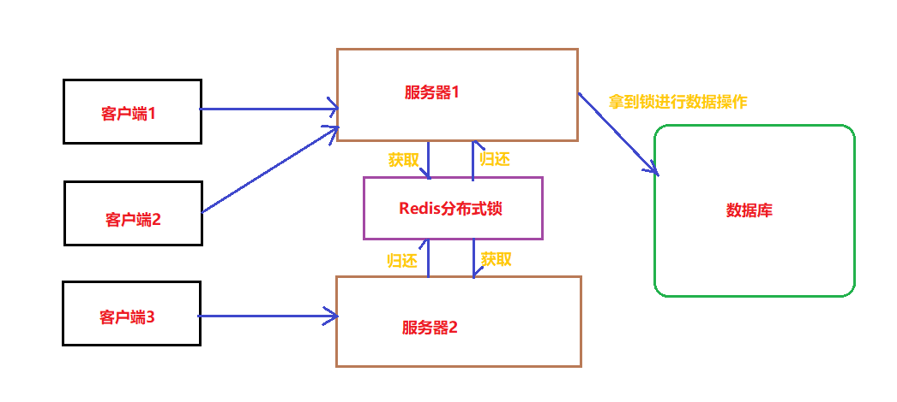
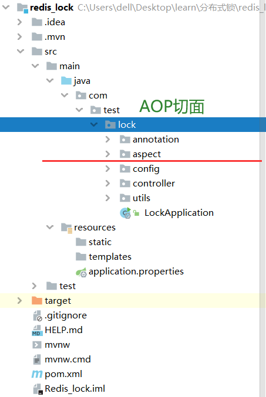

## 一、分布式锁概述：

在多线程环境下，为了保证同一时间下一个代码块只能由一个线程访问，Java中一般使用 `synchorized`和 `ReentrantLock` 来实现，但这是本地锁的方式。

如果在分布式架构下，有多台服务器分别都部署了应用，应该如何实现？

**使用分布式锁来实现**。


### 1.1 举例说明

比如说在一个分布式系统中，多台机器上部署了多个服务，当客户端一个用户发起一个数据插入请求时，如果没有分布式锁机制保证，那么多台机器上的多个服务可能进行并发插入操作。这就可能导致数据的重复插入。

分布式锁的出现保证了多个服务之间互斥的访问共享资源，如果一个服务占有了分布式锁，其它服务没有获取锁，那么就不进行后续操作。




### 1.2 分布式锁的特点

* 互斥性：同一时刻只能有一个服务能够持有锁；
* 可重入性：同一结点上的同一个服务如果获取了锁之后能够再次获取锁；
* 锁超时：防止死锁；
* 高性能和高可用：加锁和解锁需要高效，同时也需要保证高可用，防止分布式锁失效；
* 具备阻塞和非阻塞性：能够及时从阻塞状态中被唤醒；


### 1.3 分布式锁的实现方式

一般有如下几种方式：




## 二、Redis分布式锁的实现

### 2.1 基于 setnx + expire（错误的）

`setnx` 保证了锁不存在时才能获取设置成功（成功获取锁）。命令成功返回1，失败放回0.

`expire` 保证了锁具有一定的时效性，防止死锁。


代码实现：

```java
public boolean tryLock(String key,String request,int timeout){
  Long result = jedis.setnx(key,request);
  if(result == 1){
    return jedis.expire(key,timeout)==1;
  }
  else{
    return false;
  }
}
```


存在的问题：

主要就是 `setnx` 和 `expire` 两条命令是分开执行的，不是一个原子操作。

那么在服务情况下，如果服务A提前执行了`setnx` 命令，但是还没来得及执行 `expire`命令就发生了问题，服务被重启了，此时分布式锁就没有过期时间，一直得不到释放。


### 2.2 基于 setnx+expire+lua脚本（正确做法）

lua 脚本能够有效保证多个操作的原子性。

```java
public boolean tryLock_with_lua(String key,String uniqueId,int seconds){
    String lua_scripts = "if redis.call('setnx',KEYS[1],ARGV[1]) == 1 then" +
            "redis.call('expire',KEYS[1],ARGV[2]) return 1 else return 0 end";
    List<String> keys = new ArrayList<>();
    List<String> values = new ArrayList<>();
    keys.add(key);
    values.add(UniqueId);
    values.add(String.valueOf(seconds));
    Object result = jedis.eval(lua_scripts, keys, values);
    //判断是否成功
    return result.equals(1L);
}
```


### 2.3 使用 set key value [EX seconds] [PX milliseconds] [NX|XX] 命令（正确做法）

对于命令 `set key value [EX seconds][PX milliseconds][NX|XX]`

* EX seconds：设定过期时间，单位为秒；
* PX milliseconds：设定过期时间，单位为毫秒；
* NX：键不存在时才设置值；
* XX：仅当键存在时才设置值


代码：

```java
public boolean tryLock_with_set(String key,String uniqueId,int seconds){
    return "OK".equals(jedis.set(key,unqueId,"NX","EX",seconds));
}
```


需要注意的问题：

##### （1）value必须具有唯一性

假设对于多个服务而言，value 值不唯一，模拟下述情况

* 客户端1获取锁成功；
* 客户端1阻塞在某个操作上，花费了大量时间；
* 设定的锁的key过期了，锁自动释放了；
* 客户端2获取到了对应同一个资源的锁；
* 客户端1从阻塞中恢复过来，因为value的值一样，所以执行释放锁操作时就会释放掉客户端2持有的锁，这样就会出现问题。

释放锁的时候我们会对锁进行检测，如果该锁是自己的才能释放，因此value值必须唯一进行区分，可以通过UUID来实现。


##### （2）释放锁的实现

释放锁时检测value值，判断是否是自己的。

```java
public boolean releaseLock_with_lua(String key,String value){
  String luaScript = "if redis.call('get',KEYS[1]) == ARGV[1] then" + 
    "return redis.call('del',KEYS[1]) else return 0 end";
  return jedis.eval(luaScript,Collections.singletonList(key),Collections.singletonList(value));
}
```

使用 lua 脚本保证释放锁的时候也是原子操作。


##### （3）`set key value [EX seconds][PX milliseconds][NX|XX]` 命令存在的问题

该命令在Redis集群中也会出现问题：主机发生故障时可能会导致多个客户端拿到锁。

详细解释：

比如说集群环境下，客户端A在 Redis的 master节点上拿到了锁，但是这个加锁的 key还未同步到 slave 结点。

此时 master 结点如果发生了故障，就必须进行故障转移，那么一个 slave 结点就会被选举为新的 master结点

此时客户端B访问 slave 结点，也可以获取到锁。总体上就导致了多个客户端拿到了锁。


### 2.4 基于 Redlock（最完善的分布式锁）

参考： https://mp.weixin.qq.com/s?__biz=MzU5ODUwNzY1Nw==&mid=2247484155&idx=1&sn=0c73f45f2f641ba0bf4399f57170ac9b&scene=21#wechat_redirect

 

假设现在有5个独立的Redis结点（这里的5个结点可以是**5个Redis单master实例**、**5个Redis Cluster集群**，但注意不能是一个有5个主节点的master集群）

* 获取Unix时间，以毫秒为单位；
* 以此从5个实例中使用相同的key 和具有唯一性的 value（比如 UUID）来获取锁，当向 Redis请求获取锁时，客户端应该设置一个网络连接和响应超时时间，这个超时时间应当小于锁的超时时间。（比如锁的自动失效时间为10秒，超时时间应该设置在5~50ms之间，这样可以避免服务器端Redis已经挂掉的情况下，客户端还在死死地等待结果。如果服务端没有在规定时间内响应，客户端应该尽快尝试去另外一个Redis实例请求获取锁）。
* 客户端使用当前时间减去开始获取锁的时间，这个时间作为获取锁使用的时间。 并且必须当大多数(N/2+1，N=5时为3个结点)的Redis结点都获取到锁，并且使用的时间小于锁失效的时间，锁才算成功获取。
* 如果获取到了锁，key的真正有效时间等于有效时间减去获取锁所使用的时间。
* 如果某些原因，获取锁失败（没有至少 N/2+1个结点获取到锁），服务端就应该在所有的结点上解锁，防止某些结点获取到锁但是客户端没有得到响应而导致接下来的一段时间不能重新获取锁。


`Redisson` 和 Jedis类似都是 Java的客户端，Jedis是阻塞式 I/O，而 Redisson 底层使用 Netty可以实现非阻塞 I/O，该客户端封装了锁，继承了 java.util.concurrent 的Lock接口，所以我们可以像使用 ReentrantLock 一样使用 Redisson。

1. 引入 POM 依赖

```xml
      <dependency>
          <groupId>org.redisson</groupId>
          <artifactId>redisson</artifactId>
          <version>3.10.6</version>
      </dependency>
```

2. 使用 Redisson（方法类似于 ReentrantLock）

```java
public class test {
    private static String REDLOCK_KEY = "lockName";

    public boolean try_lock(){
        //1.配置 Redisson
        Config config = new Config();
        config.useSentinelServers().addSentinelAddress("127.0.0.1:6379","127.0.0.1:6389","127.0.0.1:6399")
                .setMasterName("masterName").setPassword("password").setDatabase(0);

        //2.创建RedissonClient
        RedissonClient client = Redisson.create(config);

        //3.设定锁资源名称并获取锁
        RLock redlock = client.getLock(REDLOCK_KEY);
        boolean isLock;

        try {
            //500ms拿不到锁就认为上锁失败； 10000ms是锁的失效时间
            isLock = redlock.tryLock(500, 10000, TimeUnit.MILLISECONDS);

            //如果成功加锁....
            if(isLock){
                //执行一些列操作。。。。。。
            }
        } catch (InterruptedException e) {
            return false;
        } finally {
            //最后需要进行解锁
            redlock.unlock();
        }
        return true;
    }
}
```

更详细：https://www.cnblogs.com/cjsblog/p/11273205.html


## 三、自实现Redis分布式锁（轮子）

#### 结构图



我们要做的就是对于多个服务器的请求，利用 Redis的 `set key value .....` 来分配对应的锁。




#### 核心代码

1. Redis锁注解（存储关于锁的信息）

```java
@Documented
@Retention(RetentionPolicy.RUNTIME)
@Target({ElementType.METHOD,ElementType.TYPE})
public @interface RedisLock {

    /**
     * 分布式锁的 key
     */
    String key();

    /**
     * 锁的过期时间，默认5秒
     * @return
     */
    int expire() default 5;

    /**
     * 尝试加锁，最多等待时间
     * @return
     */
    long waitTime() default Long.MIN_VALUE;

    /**
     * 锁的超时时间单位
     * @return
     */
    TimeUnit timeUnit() default TimeUnit.SECONDS;
}
```

这样用注解存储锁的信息，不仅可以结合 aop 进行切面织入，而且在实际方法上可以自由更改锁的信息，比如说锁的过期时间可以随实际情况更改。


2. AOP 切面

```java
@Aspect
@Component
public class LockAspect {
     @Autowired
     private RedisLockHelper redisLockHelper;
     @Autowired
     private JedisUtil jedisUtil;

     Logger logger = LoggerFactory.getLogger(LockAspect.class);


     @Pointcut("@annotation(com.test.lock.annotation.RedisLock)")
     public void redisLock(){}

     @Around("redisLock()")
     public Object around(ProceedingJoinPoint joinPoint){
          //获取到 Jedis客户端
          Jedis jedis = jedisUtil.getJedis();
          //从切面对应方法的注解中获取锁的相关信息
          MethodSignature signature = (MethodSignature) joinPoint.getSignature();
          Method method = signature.getMethod();
          //获取到注解
          RedisLock annotation = method.getAnnotation(RedisLock.class);
          String key = annotation.key();
          String uuid = UUID.randomUUID().toString();
          int expireTime = annotation.expire();

          //加锁操作
          try {
               boolean isLock = redisLockHelper.lock(jedis, key, uuid, expireTime, annotation.timeUnit());
               logger.info("isLock：",isLock);
               if(!isLock){
                    logger.error("----获取锁失败----");
                    throw  new RuntimeException("获取锁失败");
               }
               //否则获取成功，执行业务操作
               try {
                    return joinPoint.proceed();
               } catch (Throwable throwable) {
                    throw  new RuntimeException("系统异常");
               }
          } catch (Exception e) {
               e.printStackTrace();
          } finally {
               logger.info("----释放锁----");
               redisLockHelper.unlock(jedis,key,uuid);
               if(jedis != null)
                    jedis.close();
          }
          return null;
     }
}
```

主要操作就是通过 Redis设置锁，设置成功进行业务处理，失败提示获取锁失败。


3. 分布式锁核心操作类（包括获取锁、释放锁）

```java
@Component
public class RedisLockHelper {
    //解决超时等待，每 sleepTime检查一次是否等待超时
    private long sleepTime = 100;

    /**
     * 指定锁的有效时间并添加分布式锁
     * set key value [EX seconds][PX milliseconds] [NX|XX] 添加分布式锁
     * @param jedis
     * @param key
     * @param value
     * @param timeout
     * @return
     */
    public boolean lock(Jedis jedis, String key, String value, int timeout, TimeUnit timeUnit){
        long seconds = timeUnit.toSeconds(timeout);
        SetParams setParams = new SetParams();
        setParams.ex((int) seconds);
        setParams.nx();
        return "OK".equals(jedis.set(key,value,setParams));
    }

    /**
     * lua脚本 + setnx + expire 进行加锁
     * @param jedis
     * @param key
     * @param value
     * @param seconds
     * @return
     */
    public boolean lock_with_lua(Jedis jedis,String key,String value,int seconds){
        String lua_scripts = "if redis.call('setnx',KEYS[1],ARGV[1]) == 1 then" +
                "redis.call('expire',KEYS[1],ARGV[2]) return 1 else return 0 end";
        List<String> keys = new ArrayList<>();
        List<String> values = new ArrayList<>();
        keys.add(key);
        values.add(value);
        values.add(String.valueOf(seconds));
        Object result = jedis.eval(lua_scripts, keys, values);
        //判断是否成功
        return result.equals(1L);
    }

    /**
     * 加锁同时设置等待超时时间 waitTime
     * @param jedis
     * @param key
     * @param value
     * @param timeout
     * @param waitTime
     * @param timeUnit
     * @return
     */
    public boolean lock_with_waitTime(Jedis jedis,String key,String value,int timeout,long waitTime,TimeUnit timeUnit) throws InterruptedException {
        long seconds = timeUnit.toSeconds(timeout);
        while(waitTime > 0){
            SetParams params = new SetParams();
            params.nx();
            params.ex((int)seconds);
            if("OK".equals(jedis.set(key,value,params))){
                 return true;
            }
            waitTime -= sleepTime;
            Thread.sleep(sleepTime);
        }
        return false;
    }

    /**
     * lua脚本 + del 解锁
     * @param jedis
     * @param key
     * @param value
     * @return
     */
    public boolean unlock(Jedis jedis,String key,String value) {
        String luaScript = "if redis.call('get',KEYS[1]) == ARGV[1] then " +
                "return redis.call('del',KEYS[1]) else return 0 end";
        return jedis.eval(luaScript, Collections.singletonList(key), Collections.singletonList(value)).equals(1L);
    }
}
```


## 四、Redisson 使用案例

虽然自己动手实现了简单的分布式锁，但是由于仍然是基于单机Redis，如果是对于Redis集群而言，还有待探讨。

Redisson 是官方推荐的 Java版的 Redis客户端，功能很多，这里用它来实现分布式锁的功能。

参考文章：

https://juejin.cn/post/6844903830442737671

